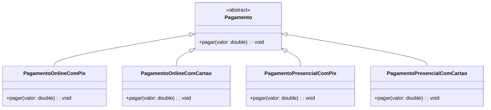
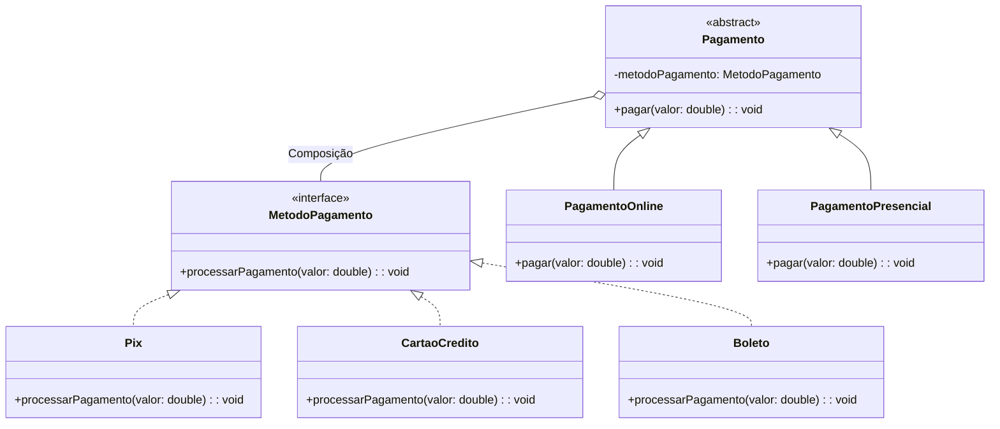

# Bridge

## Intenção
Desacoplar uma abstração de sua implementação para que as duas possam variar independentemente.

## Também conhecido como
Handle / Body  

## Motivação
Imagine que um sistema de pagamentos precisa oferecer várias formas de pagamento, como online e presencial, e também suportar diversos métodos, como Pix, Cartão de Crédito e Boleto Bancário.

### Situação sem Bridge:
Se criarmos uma classe para cada combinação, teríamos algo como:
```java
abstract class Pagamento {
    abstract void pagar(double valor);
}

class PagamentoOnlinePix extends Pagamento {
    @Override
    void pagar(double valor) {
        System.out.println("[Pagamento Online] Pagamento de R$" + valor + " via Pix.");
    }
}

class PagamentoOnlineCartao extends Pagamento {
    @Override
    void pagar(double valor) {
        System.out.println("[Pagamento Online] Pagamento de R$" + valor + " via Cartão.");
    }
}

class PagamentoPresencialBoleto extends Pagamento {
    @Override
    void pagar(double valor) {
        System.out.println("[Pagamento Presencial] Boleto gerado para pagamento de R$" + valor);
    }
}
```
**O número de classes cresce rapidamente à medida que novas formas de pagamento ou métodos de pagamento são adicionados. Isso deixa o sistema rígido, difícil de manter e pouco escalável representando uma herança pesada**

## Solução com Bridge:
O padrão Bridge resolve o problema separando a abstração (Pagamentos) da implementação concreta (Métodos de Pagamento).

Assim:
- Podemos criar novas formas de pagamento sem mexer nos métodos de pagamento.
- Podemos adicionar novos métodos de pagamento sem mexer nas abstrações de pagamento.
- O código fica flexível, coeso e fácil de manter.

## Use o padrão Bridge quando:

- Você quer separar uma abstração de sua implementação para permitir que ambos evoluam de forma independente.
- O sistema precisa de múltiplas variações combináveis de abstrações e implementações.
- Você quer reduzir o número de classes e evitar a explosão de subclasses.

## Estrutura

### Antes do Bridge (Alta dependência entre as partes)


### Depois com Bridge (Abstração desacoplada da Implementação)


## Participantes:

- MetodoPagamento (Interface): Define o contrato comum para todos os métodos de pagamento.
- Pix, CartaoCredito, Boleto (Implementadores): Implementam a interface MetodoPagamento e definem como o pagamento é processado.
- Pagamento (Abstração): Define a interface de alto nível para diferentes tipos de pagamento. Mantém uma referência para um objeto MetodoPagamento.
- PagamentoOnline, PagamentoPresencial (Refinados da Abstração): Estendem a abstração Pagamento e personalizam a operação pagar().
- Main (Cliente): Cria instâncias de pagamentos com diferentes métodos de pagamento e realiza operações.

## Colaborações:
- A abstração (Pagamento) delega o trabalho real de processamento para o MetodoPagamento.
- O cliente manipula objetos Pagamento, que podem ser configurados com diferentes MetodoPagamento, sem depender diretamente das implementações.

## Consequências:
- Desacoplamento: Abstração e implementação podem ser desenvolvidas e estendidas de forma independente.
- Melhor organização: Reduz a complexidade de classes combinatórias.
- Flexibilidade: Novas abstrações e implementações podem ser combinadas sem modificar código existente.

## Implementação

### Tabela de Estrutura GOF
| Papel no Bridge        | Classe no Código                      |
|------------------------|--------------------------------------|
| Abstraction        | Pagamento                            |
| RefinedAbstraction | PagamentoOnline, PagamentoPresencial |
| Implementor        | MetodoPagamento (interface)          |
| ConcreteImplementor| Pix, CartaoCredito, Boleto           |


### Código com Bridge aplicado
```java
package pagamento;

public class Main {
    public static void main(String[] args) {
        MetodoPagamento pix = new Pix();
        MetodoPagamento cartao = new CartaoCredito();
        MetodoPagamento boleto = new Boleto();

        Pagamento pagamento1 = new PagamentoOnline(pix);
        Pagamento pagamento2 = new PagamentoPresencial(cartao);
        Pagamento pagamento3 = new PagamentoOnline(boleto);

        pagamento1.pagar(150.00);
        pagamento2.pagar(200.50);
        pagamento3.pagar(300.75);
    }
}
```

```java
package pagamento;

interface MetodoPagamento {
    void processarPagamento(double valor);
}
```

```java
package pagamento;

abstract class Pagamento {
    protected MetodoPagamento metodoPagamento;

    public Pagamento(MetodoPagamento metodoPagamento) {
        this.metodoPagamento = metodoPagamento;
    }

    abstract void pagar(double valor);
}
```

```java
package pagamento;

class PagamentoOnline extends Pagamento {
    public PagamentoOnline(MetodoPagamento metodoPagamento) {
        super(metodoPagamento);
    }

    @Override
    void pagar(double valor) {
        System.out.println("[Pagamento Online]");
        metodoPagamento.processarPagamento(valor);
    }
}
```

```java
package pagamento;

class PagamentoPresencial extends Pagamento {
    public PagamentoPresencial(MetodoPagamento metodoPagamento) {
        super(metodoPagamento);
    }

    @Override
    void pagar(double valor) {
        System.out.println("[Pagamento Presencial]");
        metodoPagamento.processarPagamento(valor);
    }
}
```

```java
package pagamento;

class Pix implements MetodoPagamento {
    @Override
    public void processarPagamento(double valor) {
        System.out.println("Pagamento de R$" + valor + " realizado via Pix.");
    }
}
```

```java
package pagamento;

class CartaoCredito implements MetodoPagamento {
    @Override
    public void processarPagamento(double valor) {
        System.out.println("Pagamento de R$" + valor + " realizado via Cartão de Crédito.");
    }
}
```

```java
package pagamento;

class Boleto implements MetodoPagamento {
    @Override
    public void processarPagamento(double valor) {
        System.out.println("Boleto gerado para pagamento de R$" + valor);
    }
}
```


## Conclusão
O padrão Bridge permitiu ao sistema de pagamentos separar formas de pagamento e métodos de pagamento, facilitando a adição de novas funcionalidades sem alterar o código existente.

É ideal para cenários onde múltiplas combinações de abstrações e implementações são necessárias, promovendo flexibilidade e extensibilidade.

## Usos conhecidos:
- APIs de renderização gráfica, onde uma abstração "Janela" pode ser implementada de diferentes formas (Windows, Linux).
- Frameworks de persistência, desacoplando abstrações de banco de dados (PostgreSQL, MySQL).
- Sistemas de relatórios, separando o tipo de relatório da forma de exportação (PDF, HTML).
- Qt Framework (C++), usando Handle/Body para gerenciamento eficiente de recursos gráficos.

## Padrões relacionados:
- Adapter: Converte uma interface para outra, enquanto o Bridge separa abstração de implementação.
- Composite: Pode ser combinado com Bridge para estruturar árvores de objetos com interfaces independentes da implementação.
- Strategy: Define famílias de algoritmos de forma intercambiável, mas não separa abstração e implementação. O foco do Strategy é comportamento, enquanto o Bridge é estrutural.

## Referências
GAMMA, Erich; HELM, Richard; JOHNSON, Ralph; VLISSIDES, John. Padrões de projeto: soluções reutilizáveis de software orientado a objetos. 1. ed. Porto Alegre: Bookman, 2000.

