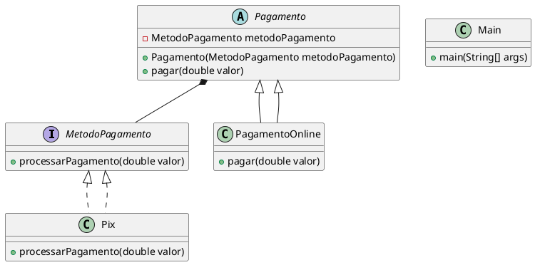

## Motivação
O sistema precisa oferecer múltiplas formas de pagamento, como pagamentos online e presenciais, utilizando diferentes métodos (cartão de crédito, Pix, boleto). Implementar todas as combinações diretamente pode resultar em um código inflexível e difícil de manter.

## UML

## Participantes

- **MetodoPagamento (Interface):** Define o contrato para os métodos de pagamento.
  
- **Pagamento (Classe abstrata):** Representa um pagamento que pode ser online ou presencial e utiliza um método de pagamento.

- **PagamentoOnline (Classe concreta):** Especialização de pagamento que processa pagamentos online.

- **Pix (Classe concreta):** Implementa a interface MetodoPagamento para processar pagamentos via Pix.

- **Main (Classe principal):** Responsável por executar o sistema e demonstrar os pagamentos em funcionamento.